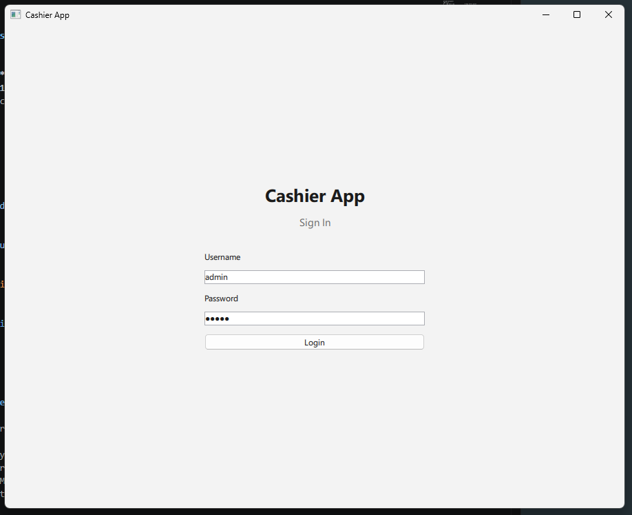
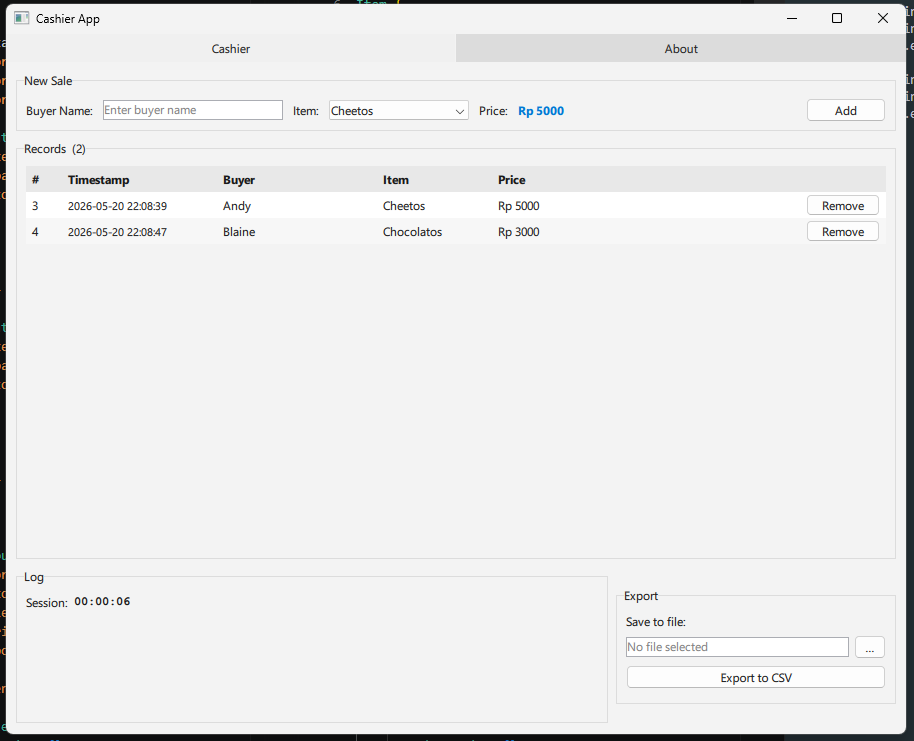
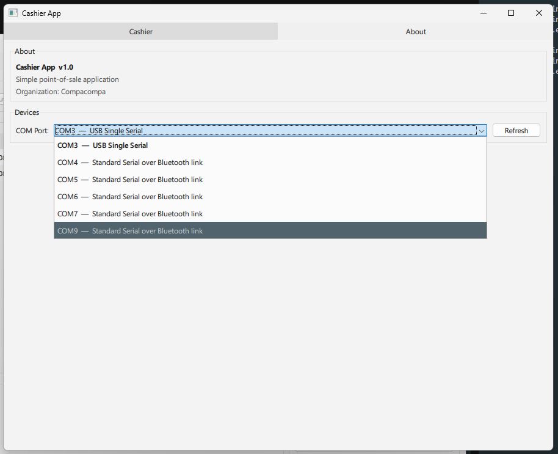

# Qt/QML MVVM Project Template

A ready-to-use boilerplate for building desktop applications with **Qt 6**, **QML**, and **C++** following the **MVVM** architectural pattern.

The included demo app is a simple point-of-sale (cashier) system — just enough real functionality to show every layer of the stack working together: authentication, SQLite persistence, CSV export, and serial port enumeration.

---

## What's Inside

| Layer | Technology | Location |
|---|---|---|
| UI | QML 2 (Qt Quick Controls 2) | `qml/` |
| Logic | C++23 QObject singletons | `src/` |
| Persistence | SQLite via Qt SQL | `src/CashierViewModel.cpp` |
| Hardware | Serial port via Qt SerialPort | `src/DeviceViewModel.cpp` |
| Build | CMake 3.16+ with presets | `CMakeLists.txt` |

### Features demonstrated

- **Login / authentication** — ViewModel-driven page switching based on auth state
- **Tabbed navigation** — `TabBar` + `StackLayout` pattern
- **CRUD with SQLite** — insert, list, delete records; auto-created database
- **Session log** — live activity log with elapsed-time counter
- **CSV export** — file-save dialog and structured export
- **COM port enumeration** — detect connected serial devices

---

## Architecture

The project uses a clean MVVM separation:

- **Models** — plain C++ structs (`src/Models.h`)
- **ViewModels** — `QObject` singletons (`src/`), exposed to QML via `QML_SINGLETON`
- **Views** — QML components (`qml/`), no business logic, pure data binding

See [`architecture.md`](architecture.md) for the full component diagram and data-flow walkthrough.

---

## Prerequisites

- **Qt 6.8+** — modules: Quick, Widgets, Sql, SerialPort
- **CMake 3.16+**
- **MinGW (g++ 13+)** or any C++23-capable compiler
- **Ninja** (recommended) or GNU Make

---

## Quick Start

```bash
# 1. Configure
cmake --preset debug-mingw

# 2. Build
cmake --build build-debug-mingw

# 3. Run
./build-debug-mingw/qt_qml_project.exe
```

Login with `admin` / `admin`.

Other available presets: `release-mingw`, `profile-mingw`, `debug-mingw-makefiles`.

---

## Using as a Template

To base a new project on this boilerplate:

1. Clone or copy this repository
2. Rename the project in `CMakeLists.txt` (`project(...)` and `qt_add_executable(...)`)
3. Rename the QML module in `qt_add_qml_module(... URI YourAppName ...)`
4. Replace the three demo ViewModels with your own domain logic (follow the same `QML_SINGLETON` pattern)
5. Update `qml/Main.qml` as your new root component

The build system, `.qmlls.ini`, and CMake presets all work out of the box with no further changes.

---

## Opening in Qt Designer / Qt Creator

The file **`qt_qml_project.qmlproject`** is a Qt Design Studio project file. Opening it in Qt Design Studio gives you:

- Full QML file indexing and navigation
- Live QML design view

To open: **File → Open File or Project** in Qt Design Studio, select `qt_qml_project.qmlproject`.

> The `.qmlproject` file is for design-time tooling only. The actual build uses CMake.

---

## Project Structure

```
qt-qml-project/
├── src/
│   ├── main.cpp               # App entry point
│   ├── Models.h               # Data structs
│   ├── AuthViewModel.h/.cpp   # Auth state
│   ├── CashierViewModel.h/.cpp# Sales logic + DB
│   └── DeviceViewModel.h/.cpp # Serial port detection
├── qml/
│   ├── Main.qml               # Root window
│   ├── LoginPage.qml
│   ├── MainPage.qml           # Tab container
│   └── tabs/
│       ├── CashierTab.qml     # POS interface
│       └── AboutTab.qml       # Info + devices
├── CMakeLists.txt
├── CMakePresets.json
├── qt_qml_project.qmlproject  # Qt Creator / Design Studio
├── qml.qrc                    # QML resource registration
└── architecture.md            # Detailed architecture docs
```

---

## Screenshots





---

## QT QML Cheat Sheet
C++ as engine, QML as steering wheel.
 * **Properties (Q_PROPERTY) ── The State (CRUD)**
   * **What it is:** A smart variable wrapper (buyerName, currentPrice).
   * **Pointer:** Keeps C++ data variables and QML UI elements perfectly synchronized. If C++ updates a value, QML updates the screen automatically.
 * **Signals (signals:) ── The Broadcasters (Notifications)**
   * **What it is:** An event alarm (currentPriceChanged(), recordsChanged()).
   * **Pointer:** Functions with *no body* in C++. You just emit them to shout, *"Hey! Something changed, come update yourself!"*
 * **Slots (public slots:) ── The Actions (Responders)**
   * **What it is:** Normal C++ functions (onExport(), onAddRecord()) made visible to the event loop.
   * **Pointer:** Written and executed entirely in **C++**, but triggered easily by QML UI interactions (like clicking a button).
 * **Invokables (Q_INVOKABLE) ── The Direct Hotline**
   * **What it is:** Standard C++ methods (setBuyerName()) exposed to the frontend.
   * **Pointer:** Allows QML to directly execute specific C++ backend logic or pass raw parameters down on demand.
### The Golden Rule of Qt Bridge Architecture
>  * **Data goes UP** (C++ \rightarrow QML) via **Properties** and **Signals**.
>  * **Commands go DOWN** (QML \rightarrow C++) via **Slots** and **Invokables**.
>

---

## License

MIT — use freely as a starting point for your own Qt/QML projects.
